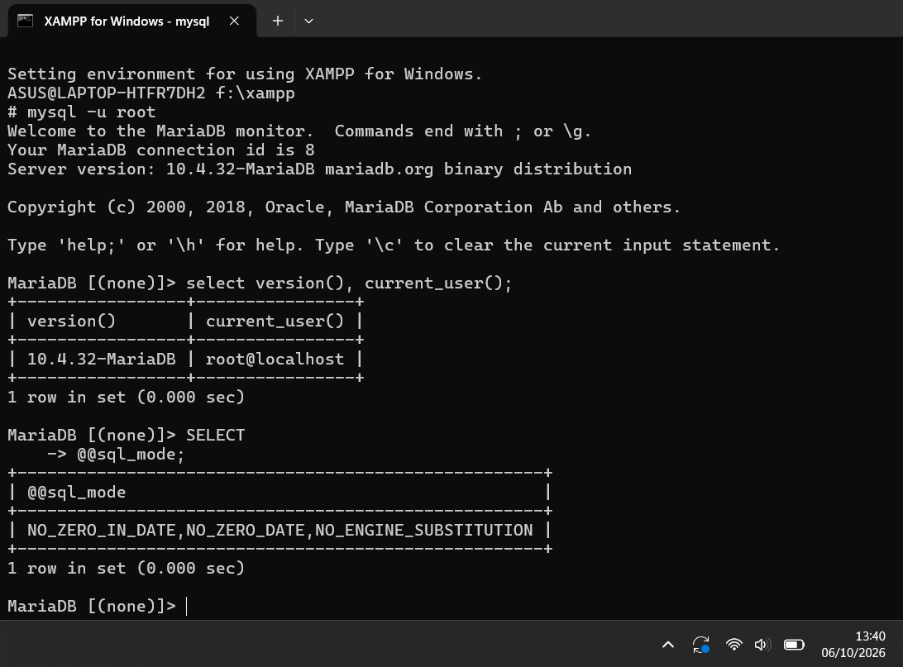
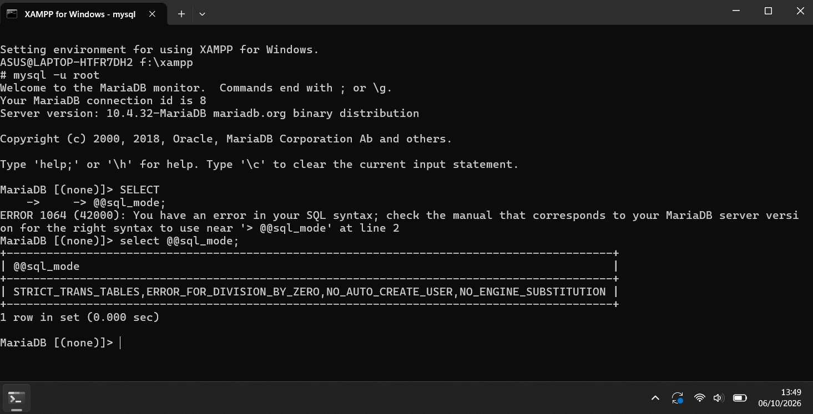
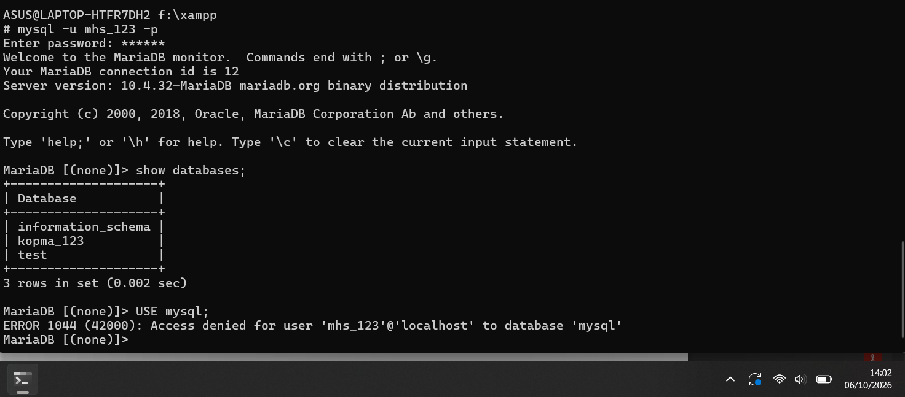
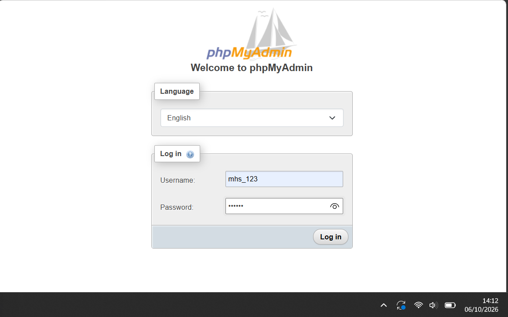

# Laporan Praktikum Basis Data
**Nama:** Ridho Naufal Farras Siddik 
**NIM:** 25430095
**Kelas:** D  
**Pertemuan:** 1  
**Tanggal:** 7/10/26  
**Dosen/Asisten:** Dedi Irawan, S.Kom., M.T.I.  

---

## 1. Tujuan Praktikum
Memahami cara mengoperasikan layanan MariaDB via XAMPP, menghubungkan klien baris perintah (CLI) dan phpMyAdmin, mengamankan root, membuat akun kerja berbasis hak akses minimum, serta menginisialisasi catatan kerja menggunakan Git dan GitHub.

## 2. Ringkasan Dasar Teori
DBMS (Database Management System) adalah perangkat lunak yang bertugas mengatur penyimpanan, keamanan, integritas, dan konsistensi data secara terpusat. MariaDB bekerja menggunakan model klien-server, di mana proses daemon `mysqld` menerima permintaan kueri melalui protokol TCP pada port 3306.

## 3. Hasil Langkah Percobaan

### a. Verifikasi Versi Server & Pengguna Aktif

*Keterangan: Menjalankan kueri `SELECT VERSION(), CURRENT_USER();` di klien MariaDB.*

### b. Pemeriksaan Mode SQL Server

*Keterangan: Menampilkan `SELECT @@sql_mode;` untuk memastikan STRICT_TRANS_TABLES aktif.*

### c. Akses Akun Kerja mhs_<3d>

*Keterangan: Menjalankan `SHOW DATABASES;` dengan akun mhs_<3d> yang hanya melihat basis data miliknya dan information_schema.*

### d. Bukti Galat 1044 & 1142

*Keterangan: Akun mhs_<3d> ditolak saat mencoba `USE mysql;` (ERROR 1044).*

*Keterangan: Bukti penolakan perintah karena ketiadaan hak akses (ERROR 1142).*

### e. Tampilan Masuk phpMyAdmin Mode Cookie

*Keterangan: Halaman autentikasi login phpMyAdmin setelah konfigurasi diubah ke mode cookie.*

## 4. Jawaban Titik Analisis

* **Titik Analisis 1:**  
Meskipun panel XAMPP berlabel "MySQL", mesin relasional yang sesungguhnya berjalan adalah MariaDB 10.4. Dokumentasi MySQL tetap relevan untuk sintaks kueri ANSI SQL standar dasar (DDL/DML umum). Namun, untuk fitur mesin penyimpanan internal, variabel sistem, autentikasi pengguna, urutan pembaruan keamanan, dan fitur khusus per versi, dokumentasi resmi MariaDB wajib menjadi rujukan utama guna menghindari salah penanganan arsitektur.
* **Titik Analisis 2:**  
Ketika masuk dengan `mysql -u root` tanpa `-p` setelah akun root diberi sandi, server memunculkan pesan:`ERROR 1045 (28000): Access denied for user 'root'@'localhost' (using password: NO)`.Frasa kunci yang membuktikan klien tidak mengirimkan kata sandi sama sekali adalah `(using password: NO)`.
* **Titik Analisis 3:**  
`information_schema` tetap terlihat karena merupakan skema metadata standar ANSI yang bersifat read-only untuk menyediakan definisi tabel dan hak akses yang dimiliki oleh pengguna yang sedang login. Sebaliknya, basis data `mysql` ditolak dengan `ERROR 1044` karena berisi tabel kredensial dan hak akses global server yang terlarang untuk akun non-administratif.Perbedaan galat: **ERROR 1044** terjadi saat pengguna berhasil masuk ke server tetapi ditolak mengakses skema basis data tertentu karena ketiadaan privilege; sedangkan **ERROR 1045** terjadi pada tahap awal saat kredensial autentikasi (kombinasi username/password/host) salah atau ditolak oleh server saat memulai koneksi.
* **Titik Analisis 4:**  
Mode `cookie` jauh lebih aman karena kredensial autentikasi diverifikasi per sesi melalui enkripsi peramban dan tidak disimpan dalam teks polos (*plaintext*) pada berkas konfigurasi lokal `config.inc.php`.

## 5. Hasil Latihan dan Modifikasi
Sajikan hasil pengerjaan Latihan E:
1. (<tamu 123 part 1.png>)
2. (<tamu 123 part 2.png>)

## 6. Tugas Mandiri: Milestone Proyek 1
Jelaskan pembuatan basis data dan akun proyek pribadi Anda:
* Nama basis data proyek: `akad_095`
* Akun pengembang proyek: `dev_095`
* Bukti bahwa `dev_095` dapat mengakses basis data proyek dan tidak bisa membuka `akad_095`.

## 8. Kesimpulan
Tuliskan 2 sampai 4 kalimat kesimpulan atas capaian modul ini dengan bahasa sendiri.

## 9. Pernyataan Penggunaan AI
digunakan untuk menyusun laporan dan menjawab beberapa pertanyaan

## 10. Bukti Git
* **Tautan Repositori:** https://github.com/zareo-art/basisdata-25430095.git
* **Commit Hash:** utf8mb4
* **Pesan Commit:** `p01: milestone proyek 1`

---

## Checklist Laporan Pertemuan 1
Salin dan beri tanda centang `[x]` pada butir yang telah terpenuhi:

- [x] Berkas `p01_lingkungan_<NIM>.sql` (dapat dijalankan ulang)
- [x] Berkas `README.md` berisi Identitas Proyek
- [x] Berkas `.gitignore`
- [x] Bukti tangkapan layar `SELECT VERSION(), CURRENT_USER();`
- [x] Bukti tangkapan layar `SELECT @@sql_mode;`
- [x] Bukti tangkapan layar `SHOW DATABASES` sebagai `mhs_<3d>` dan `dev_<3d>`
- [] Bukti tangkapan layar galat 1044 dan 1142
- [x] Bukti tangkapan layar halaman login phpMyAdmin mode cookie
- [x] Bukti tangkapan layar `git push` pertama
- [x] Analisis Titik Analisis 1–4 terjawab lengkap
- [] Pembahasan perbedaan kode galat 1044, 1045, dan 1142