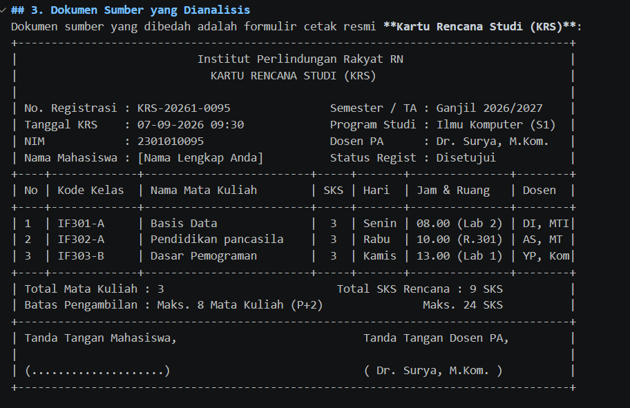
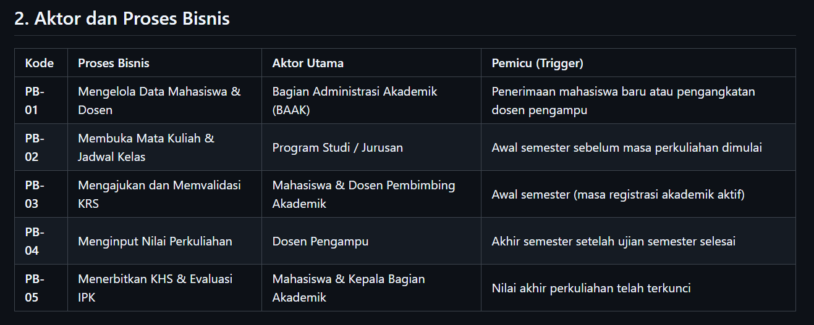
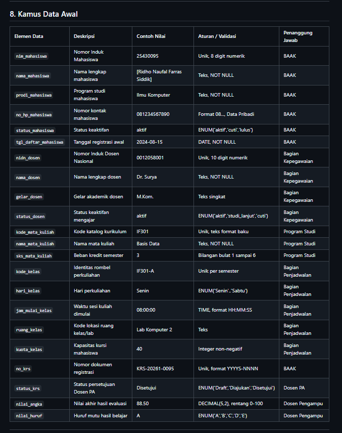

# Laporan Praktikum Basis Data

**Nama:** [Ridho Naufal Farras Siddik]  
**NIM:** 25430095  
**Kelas:** [D]  
**Pertemuan:** 2  
**Tanggal:** 07 Oktober 2026  
**Dosen:** Dedi Irawan, S.Kom., M.T.I.  

---

## 1. Tujuan Praktikum
Praktikum ini bertujuan untuk menganalisis proses bisnis dan aktivitas akademik pada Institut Perlindungan Rakyat RN, membedah dokumen sumber Kartu Rencana Studi (KRS), menyusun entitas kandidat beserta kamus data awal, merumuskan aturan bisnis yang dapat diuji dengan parameter personal NIM, serta memetakan matriks operasi CRUD antar-entitas data.

## 2. Ringkasan Dasar Teori
Analisis kebutuhan merupakan fondasi awal perancangan basis data sebelum tahap pemodelan konseptual, skema logis, dan implementasi fisik DDL. Pada tahap ini, data diposisikan sebagai aset institusi yang lahir dari aktivitas operasional nyata, memiliki penanggung jawab khusus (*data steward*), dan membutuhkan pembatasan akses terkait data pribadi.

Instrumen utama yang digunakan dalam analisis adalah matriks CRUD dan kamus data. Matriks CRUD memetakan relasi proses bisnis terhadap siklus hidup data untuk mencegah timbulnya entitas yatim (*orphan entities*). Kamus data mendefinisikan atribut secara presisi dan menetapkan aturan integritas sejak awal agar basis data terbebas dari ambiguitas semantik.

## 3. Hasil Langkah Percobaan
Percobaan analisis kebutuhan data proyek akademik `akad_095` menghasilkan dokumen spesifikasi yang diunggah ke repositori GitHub.

### a. Pembedahan Dokumen Sumber KRS
Analisis formulir Kartu Rencana Studi (KRS) memisahkan antara atribut identitas transaksi, relasi aktor mahasiswa/dosen, rincian kelas kuliah, serta nilai turunan berupa beban SKS kumulatif.

*Keterangan: Dokumen sumber formulir KRS Institut Perlindungan Rakyat RN.*

### b. Tabel Proses Bisnis (PB) dan Aturan Bisnis (AB)
Spesifikasi 5 proses bisnis utama (PB-01 s.d. PB-05) dan 8 aturan bisnis terukur (AB-01 s.d. AB-08) pada repositori GitHub.

*Keterangan: Tampilan tabel proses bisnis dan aturan bisnis proyek akad_095 di GitHub.*

### c. Matriks CRUD Proyek Akademik
Matriks verifikasi memastikan seluruh entitas (Mahasiswa, Dosen, Mata Kuliah, Kelas, KRS, Detail KRS) memiliki proses penciptaan (*Create*) yang sah.

*Keterangan: Matriks CRUD proses bisnis terhadap entitas data akademik.*

### d. Kamus Data Awal
Dokumentasi elemen data awal lengkap dengan deskripsi, tipe, format validasi, dan penanggung jawab data (*data steward*).

*Keterangan: Kamus data awal entitas akademik pada berkas p02_kebutuhan_data_2301010095.md.*

---

## 4. Jawaban Titik Analisis

* **Titik Analisis 1:**  
  Dalam konteks akademik, kurikulum atau tarif SKS mata kuliah dapat diperbarui seiring berjalannya tahun akademik. Nilai bobot SKS dan detail status kelas pada saat semester berjalan wajib tercatat permanen pada baris riwayat pendaftaran/KRS mahasiswa, bukan sekadar merujuk secara dinamis ke tabel kurikulum induk. Hal ini mencegah perubahan beban kredit masa lalu terdistorsi ketika kurikulum program studi diperbarui.
* **Titik Analisis 2:**  
  Total SKS rencana studi dan Indeks Prestasi Semester (IPS) merupakan nilai turunan (*derived attributes*). Alasan utama tidak menyimpannya dalam tabel operasional adalah prinsip konsistensi dan normalisasi: data turunan rawan menjadi inkonsisten jika ada mata kuliah yang dibatalkan atau nilai diubah. Sebaliknya, alasan yang membenarkan nilai turunan tetap disimpan (misalnya pada tabel arsip kelulusan/transkrip) adalah efisiensi performa pembacaan dan jaminan bahwa status historis kelulusan mahasiswa terkunci mutlak dari modifikasi kueri di masa mendatang.
* **Titik Analisis 3:**  
  Jika suatu entitas di matriks CRUD tidak memiliki penanda huruf 'C' (*Create*), artinya entitas tersebut menjadi "yatim" karena datanya tidak pernah dimasukkan oleh proses mana pun di dalam sistem. Pada sistem akademik, jika data Dosen atau Mata Kuliah tidak memiliki proses pembuatan, maka harus ditambahkan proses pemeliharaan data induk (misalnya: PB-01 "Registrasi Data Mahasiswa & Dosen" dan PB-02 "Penyusunan Kurikulum & Mata Kuliah"). Mengenai pembaruan status keaktifan mahasiswa, proses tersebut menjadi wewenang Bagian Administrasi Akademik (BAAK) pada awal setiap semester saat masa her-registrasi dibuka.

---

## 5. Hasil Latihan dan Modifikasi

### Perbaikan Tiga Pernyataan Kebutuhan Kabur agar Dapat Diuji:
1. **Pernyataan Kabur:** "Data anggota/mahasiswa harus aman."  
   * **Perbaikan yang Dapat Diuji:** "Atribut kontak personal (`no_hp_mahasiswa`) diklasifikasikan sebagai data pribadi terbatas yang hanya dapat dibaca oleh role `admin_baak` dan pimpinan program studi, serta wajib disamarkan (*masking*) atau diabaikan dari tampilan antarmuka publik/dosen pengampu umum."
2. **Pernyataan Kabur:** "Sistem harus cepat mencari barang/mata kuliah."  
   * **Perbaikan yang Dapat Diuji:** "Pencarian jadwal kelas perkuliahan berdasarkan `kode_mata_kuliah` atau `nama_mata_kuliah` harus menampilkan hasil dalam waktu respons di bawah 1 detik untuk beban volume katalog aktif hingga 500 kelas per semester."
3. **Pernyataan Kabur:** "Laporan stok/SKS harus akurat."  
   * **Perbaikan yang Dapat Diuji:** "Sistem memvalidasi bahwa total akumulasi SKS pada KRS mahasiswa tidak boleh melebihi 24 SKS per semester, dan pendaftaran ke suatu kelas perkuliahan otomatis ditolak jika jumlah mahasiswa terdaftar telah menyamai `kuota_kelas`."

---

## 6. Tugas Mandiri: Milestone Proyek 2

* **Organisasi Fiktif:** Institut Perlindungan Rakyat RN
* **Tema / Kode Basis Data:** Akademik (`akad_095`)
* **Perhitungan Parameter Personal ($P$):**
  * Rumus: $P = (95 \pmod 9) + 1 = 5 + 1 = \mathbf{6}$
  * Batas maksimal mata kuliah per KRS ($P + 2$): $6 + 2 = \mathbf{8\text{ mata kuliah}}$
  * Tarif denda keterlambatan registrasi: $P \times 1.000 = \mathbf{\text{Rp}6.000/\text{hari}}$
  * Perkiraan volume transaksi KRS harian: $40 + (5 \times P) = 40 + (5 \times 6) = \mathbf{70\text{ transaksi/hari}}$
* **Kelengkapan Dokumen:** Berkas `p02_kebutuhan_data_2301010095.md` telah memuat 5 proses bisnis, 6 entitas, 8 aturan bisnis, 5 kebutuhan informasi, matriks CRUD, serta kamus data awal berisi 22 elemen data lengkap dengan *data steward*.

---

## 7. Pembahasan dan Kendala
Tahapan analisis kebutuhan data memerlukan ketelitian dalam membedakan antara entitas (benda/kejadian yang dicatat) dan proses (kata kerja/tindakan). Pada kasus akademik, mata kuliah katalog harus dipisahkan dari rombongan belajar/kelas per semester karena satu mata kuliah yang sama dapat dibuka dalam beberapa kelas paralel (misalnya IF301-A dan IF301-B). Kendala penentuan atribut turunan diselesaikan dengan memastikan total SKS dan IPS dihitung secara dinamis melalui kueri dan tidak disimpan sebagai kolom tetap di tabel kepala KRS.

## 8. Kesimpulan
Dokumen kebutuhan data sistem akademik `akad_095` pada Institut Perlindungan Rakyat RN telah berhasil dirumuskan secara terstruktur. Seluruh entitas memiliki relasi alur pembuatan (*Create*) yang valid pada matriks CRUD, aturan bisnis telah terikat pada parameter personal $P=6$, dan batas privasi data kontak telah ditetapkan sesuai prinsip tata kelola data.

## 9. Pernyataan Penggunaan AI
Asisten AI digunakan untuk memverifikasi formulasi kebutuhan data agar terukur (*testable*), merapikan format matriks CRUD ke dalam sintaks Markdown, serta menyelaraskan perhitungan parameter personal $P$ dengan aturan akademik. Seluruh perumusan proses bisnis dan penentuan atribut dilakukan secara mandiri.

## 10. Bukti Git
* **Tautan Repositori:** https://github.com/zareo-art/basisdata-25430095.git
* **Hash Commit:** [6a2b932]
* **Pesan Commit:** `p02: dokumen kebutuhan data proyek akademik`

---

## Checklist Laporan Pertemuan 2
- [x] Berkas `p02_kebutuhan_data_2301010095.md` ada di repositori
- [x] Bukti tangkapan layar tabel PB, AB, KI, matriks CRUD, dan kamus data
- [x] Titik Analisis 1–3 dijawab lengkap dengan alasan
- [x] Perhitungan parameter $P$ ($P=6$) tercantum
- [x] Perbaikan 3 pernyataan kebutuhan kabur agar dapat diuji